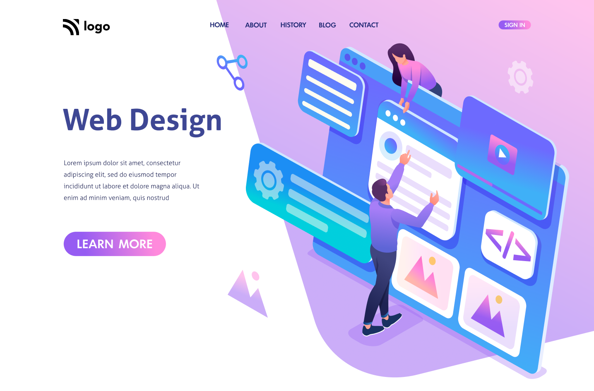

# 15 HTML & CSS Projects

## About This Repo

In this repository you will find 15 projects that I have built while undertaking a fullstack JavaScript bootcamp with Hitesh Choudary.

## Technologies Used

1. **HTML** - For Basic Web Structuring.
2. **CSS** - For design and responsive design.
3. **JS** - For Dropdown menu's.

## Projects Built

### Project 1

[Click here to see my work.](https://delicate-hotteok-391b4a.netlify.app/fullstack-project-1/)

**Provided Design**

**Limitations**
1. Mobile Responsiveness not added.

### Project 2

[Click here to see my work.](https://delicate-hotteok-391b4a.netlify.app/fullstack-project-2/)

**Provided Design**

### Project 3

[Click here to see my work.](https://delicate-hotteok-391b4a.netlify.app/fullstack-project-3/)

**Provided Design**

### Project 4

[Click here to see my work.](https://delicate-hotteok-391b4a.netlify.app/fullstack-project-4/)

**Provided Design**

### Project 5

[Click here to see my work.](https://delicate-hotteok-391b4a.netlify.app/fullstack-project-5/)

**Provided Design**

### Project 6

[Click here to see my work.](https://delicate-hotteok-391b4a.netlify.app/fullstack-project-6/)

**Provided Design**

### Project 7

[Click here to see my work.](https://delicate-hotteok-391b4a.netlify.app/fullstack-project-7/)

**Provided Design**

**Limitations**
1. Mobile Responsiveness not added (temporary fixed something to work on mobile).

### Project 8

[Click here to see my work.](https://delicate-hotteok-391b4a.netlify.app/fullstack-project-8/)

**Provided Design**

**Limitations**
1. Mobile Responsiveness not added.